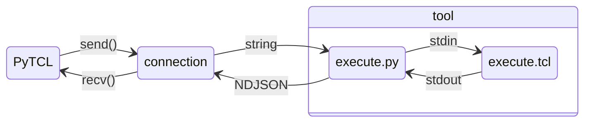

<!-- SPDX-FileCopyrightText: 2025 Tymoteusz Blazejczyk <tymoteusz.blazejczyk@tymonx.com> -->
<!-- SPDX-License-Identifier: Apache-2.0 -->

# PyTCL

**PyTCL** allows control **EDA** tools directly from **Python** that use **TCL**.

## Features

- It executes Python method with provided positional arguments directly as TCL procedure
  For example invocation of Python `<object>.<name>(*args)` method is like calling TCL procedure `<name> {*}${args}`
- Any Python value is converted to TCL value like for example Python `list` to TCL list
- Result from invoked TCL procedure is returned as `pytcl.TCLValue` that can handle any TCL value
  (that is represented always as string) to Python `str`, `int`, `bool`, `float`, `list`, `dict`, ...
- TCL error is returned as Python exception `pytcl.TCLError`
- High performance and very low (unnoticeable) overhead by using Unix domain sockets or Windows named pipes
  for communication between Python and TCL in streamable way (sockets/pipes are always open and ready)
- It allows to create and access TCL variables from Python side. Please see [tests/test_tclsh.py] for some examples
- It can work with any EDA tool. Please see [tests/test_vivado.py] how to use bare `PyTCL` class for that
- It supports Linux, macOS and Windows
- No external dependencies

## Install

```python
pip install pytcl-eda
```

## Examples

Creating new Vivado project:

```python
#!/usr/bin/env python3
from pathlib import Path
from pytcl import Vivado

def main() -> None:
    """Create new Vivado project."""
    hdl_dir: Path = Path.cwd() / "hdl"
    project_dir: Path = Path.cwd() / "my-awesome-project"

    with Vivado() as vivado:
        # See Vivado Design Suite Tcl Command Reference Guide (UG835) for all available Vivado TCL procedures
        # https://docs.amd.com/r/en-US/ug835-vivado-tcl-commands
        vivado.create_project(project_dir.name, project_dir)
        vivado.add_files(hdl_dir / "my_awesome_design.sv")

        synthesis_runs = list(vivado.get_runs("synth_*"))
        vivado.launch_runs(synthesis_runs)

        # wait_on_runs was introduced in Vivado 2021.2. For backward compatibility we will use wait_on_run
        # https://docs.amd.com/r/2021.2-English/ug835-vivado-tcl-commands/wait_on_runs
        # Vivado >= 2021.2 can just use: vivado.wait_on_runs(synthesis_runs)
        for run in synthesis_runs:
            vivado.wait_on_run(run)

        implementation_runs = list(vivado.get_runs("impl_*"))
        vivado.launch_runs(implementation_runs)

        for run in implementation_runs:
            vivado.wait_on_run(run)

        vivado.close_project()

if __name__ == "__main__":
    main()
```

To use any EDA tool where `PyTCL` doesn't provide neat helper classes like `pytcl.Vivado`
you can use the `pytcl.PyTCL` class directly:

```python
#!/usr/bin/env python3
from pathlib import Path
from pytcl import PyTCL

def main() -> None:
    """Create new Vivado project."""
    project_dir: Path = Path.cwd() / "my-awesome-project"

    # PyTCL offers some string placeholders {} that you can use:
    # {tcl}      -> it will insert <pytcl>/execute.tcl
    # {address}  -> it will insert Unix socket, Windows named pipe or network address
    cmd: list[str] = [
        "vivado",
        "-nojournal",
        "-notrace",
        "-nolog",
        "-mode",
        "batch",
        "-source",
        "{tcl}",
        "-tclargs",
        "{address}",
    ]

    with PyTCL(*cmd) as vivado:
        vivado.create_project(project_dir.name, project_dir)

        # Do the same magic that you would normally do in TCL

        vivado.close_project()

if __name__ == "__main__":
    main()
```

## Architecture



- `PyTCL` will run tool with `execute.tcl <address>` arguments in separate process
- `execute.tcl` invoked by tool will invoke `execute.py`
- `execute.py` will start new connection listener on provided `<address>`
- `PyTCL` will try connect to `<address>` as client
- `PyTCL` will transform any Python method call `<object>.<name>(*args)` to TCL expression `<name> {*}${args}`
- `PyTCL` will send TCL expression as string to `execute.py` via `<address>`
- `execute.py` will print received TCL expression to standard output `stdout`
- `execute.tcl` will capture received TCL expression from `execute.py` using standard input `stdin`
- `execute.tcl` will evaluate received TCL expression
- `execute.tcl` will print result of evaluated TCL expression back to `execute.py` using standard output `stdout`
  in form of [NDJSON] `{"result": "<tcl-result>", "status": <tcl-status>}`
- `execute.py` will capture above result using standard input `stdin` and send it back to `PyTCL`
- `PyTCL` will return received [NDJSON] message as `pytcl.TCLValue`
- `PyTCL` will raise a Python exception `pytcl.TCLError` if received TCL status was non-zero

## Development

Create [Python virtual environment]:

```plaintext
python3 -m venv .venv
```

Activate created [Python virtual environment]:

```plaintext
. .venv/bin/activate
```

Upgrade [pip]:

```plaintext
pip install --upgrade pip
```

Install project in [editable mode] with [pytest]:

```plaintext
pip install --editable .[test]
```

Run tests:

```plaintext
pytest
```

[ndjson]: https://docs.python.org/3/library/venv.html
[python virtual environment]: https://docs.python.org/3/library/venv.html
[editable mode]: https://setuptools.pypa.io/en/latest/userguide/development_mode.html
[pytest]: https://docs.pytest.org/en/stable/
[pip]: https://pip.pypa.io/en/stable/
[tests/test_tclsh.py]: https://gitlab.com/tymonx/pytcl/-/blob/main/tests/test_tclsh.py
[tests/test_vivado.py]: https://gitlab.com/tymonx/pytcl/-/blob/main/tests/test_vivado.py
